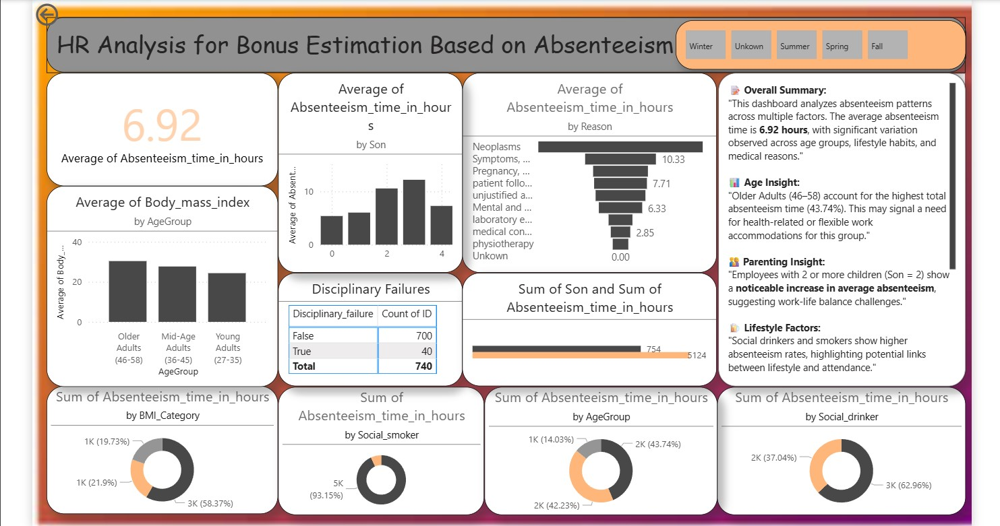

# 📊 Employee Absenteeism Analysis

This project explores patterns in employee absenteeism to support **HR decision-making for compensation and bonuses**. Using Power BI and SQL Server, this analysis helps HR teams understand which factors (age, family, health, lifestyle) influence employee attendance and how to identify compensation-worthy employees.

---

## 🧩 Objective

The goal of this project is to:
> Enable HR teams to **make fair and data-driven decisions** for employee compensation by identifying key absenteeism factors across various demographics and behaviors.

---

## 🛠️ Tools Used

| Tool                          | Purpose                                    |
|-------------------------------|--------------------------------------------|
| **Power BI**                  | Dashboard creation and visual analysis     |
| **SQL Server Management Studio** | Querying, cleaning, optimizing data       |
| **Excel / CSV**               | Source datasets                            |

---

## 📌 Dashboard Overview

The dashboard highlights average absenteeism and breaks it down by:
- **Age group**
- **Number of children (Son)**
- **Reason for absence**
- **Body Mass Index (BMI)**
- **Social habits (drinking/smoking)**
- **Disciplinary failures**

---

## 📈 Key Insights

### 🧓 Age Insight
- **Older adults (46–58)** account for **43.74%** of total absenteeism — may require flexible scheduling or health accommodations.

### 👨‍👧 Parenting Insight
- Employees with **2+ children** show **noticeably higher absenteeism**, signaling work-life balance challenges.

### 💡 Lifestyle Factors
- **Social drinkers and smokers** display higher absentee rates.
- Disciplinary failures are associated with increased absenteeism.

### 🏥 Medical Causes
- Top reasons include **neoplasms**, **mental health issues**, and **follow-up treatments**.

---

## 🧠 How SQL Helped

- Cleaned and pre-joined multiple Excel sheets (reasons, compensation, and absentee data)
- Applied filters and aggregations to simplify Power BI modeling
- Optimized queries for faster dashboard performance

---

## 🗂️ Project Structure
employee-absenteeism-analysis/
│
├── data/
│ ├── Absenteeism_at_work.csv
│ ├── compensation.csv
│ └── Reasons.csv
│
├── sql/
│ └── Compensation_Analysis.sql
│
├── reports/
│ └── HR_Absenteeism_Dashboard.pbix
│
├── images/
│ └── Dashboard.jpg
│ └── image.jpg
|
└── README.md

---

## ✅ Outcome

This project provides HR with a **clear, interactive tool** for evaluating employee absenteeism. It enables:
- **Informed compensation decisions**
- Early identification of absenteeism risk patterns
- Proactive planning for employee well-being

---

## 📌 Next Steps

- Predictive modeling for future absentee trends
- Integration with live HR systems
- Automated alerts for HR insights

---

